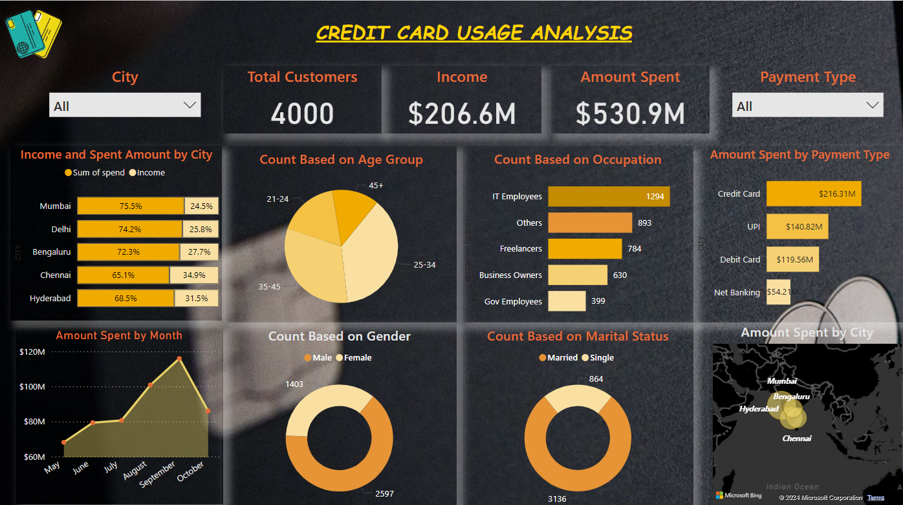

# Credit Card Usage Analysis Project

## Overview

This project, titled **Credit Card Usage Analysis**, is aimed at assisting Mitron Bank in introducing a new line of credit cards. The analysis is based on a sample dataset provided by the bank, focusing on 4000 customers across five cities and their online spending habits.

## Preview

## Project Files

1. **[PBI Report.pdf](./PBI%20Report.pdf)**: Contains the Power BI report consisting of 2 pages.
2. **[Report.pdf](./Report.pdf)**: Summarizes the final findings derived from the analysis.
3. **[preview.png](./previeww.png)**: Preview image of the first page of the Power BI dashboard.
4. **[problem_statement.pdf](./problem_statement.pdf)**: Original problem statement provided by Mitron Bank.

## Problem Statement

Mitron Bank, headquartered in Hyderabad, seeks to diversify its product offerings by introducing a new line of credit cards. AtliQ Data Services proposed a pilot project, and Peter Pandey, a data analyst, was tasked with analyzing the sample dataset to provide key findings to Mitron Bank's strategy team. The success of the project depends on Peter's ability to offer actionable, data-driven recommendations.

## Tools Used

- **MS Excel**: Used for data preparation and initial analysis.
- **Power BI**: Employed to create interactive and insightful visualizations.
- **DAX Functions**: Utilized for advanced data modeling and analysis.

## Key Findings

The detailed findings can be explored in the [Report.pdf](./Report.pdf). The analysis provides insights into customer behavior, spending patterns, and market trends, to guide Mitron Bank in tailoring their credit cards to meet customer needs effectively.

1. **City Impact on Credit Card Usage:**
   - The city of residence does not significantly affect credit card usage patterns.

2. **Age as a Dominant Factor:**
   - Age emerged as a crucial determinant of credit card usage, with higher activity in the late 20s age group.

3. **Spending Disparities Across Cities:**
   - Different spending patterns were observed among cities, with Mumbai residents exhibiting higher spending tendencies.

4. **Usage Categories and Demographics:**
   - Credit card usage categories showed associations with age groups and gender.

5. **Professional Influence:**
   - Salaried IT employees emerged as avid credit card users.

6. **Transaction Insights:**
   - UPI transactions for food-related expenses closely match credit card transactions.
   - Debit card transactions for health and wellness expenses mirror those made with credit cards.

## Recommendations

### For Target Audience

1. Align credit card features with bill payment benefits.
2. Design promotions with electronic retailers for electronics purchases.
3. Introduce cashback rewards for grocery store transactions.
4. Integrate travel benefits to attract and retain customers.

### To Broaden Audience

1. Develop targeted marketing campaigns for the 21-24 age group.
2. Utilize diverse communication channels to engage with the expanded audience.
3. Introduce credit card features catering specifically to the health and wellness needs of the 45+ age group.

### Converting Other Payment Types

1. Optimize rewards for food-related expenditures on both UPI and credit card platforms.
2. Implement wellness-focused benefits for users of both debit and credit cards.
3. Communicate the versatility of your financial products, promoting the seamless transition between UPI, credit cards, and debit cards.

Feel free to explore the provided files for a comprehensive understanding of the project.
