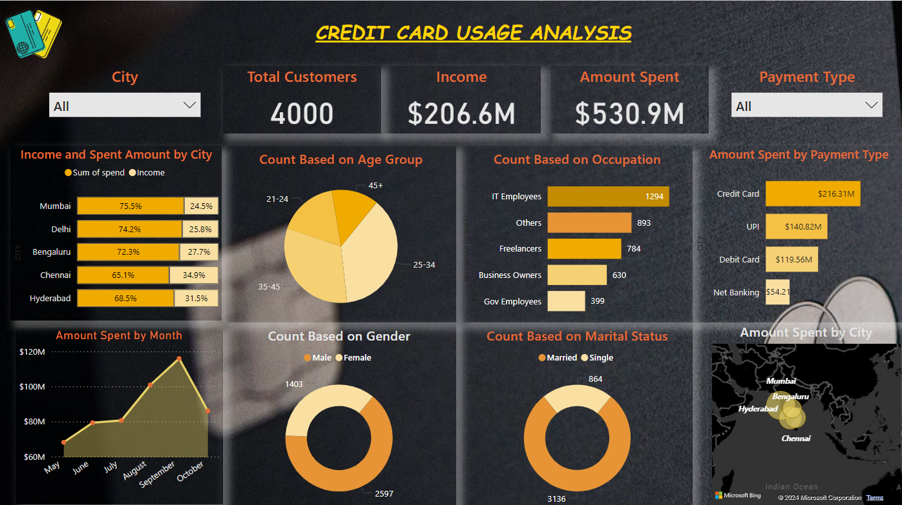

# Credit Card Usage Analysis Project

## Overview

This project, titled **Credit Card Usage Analysis**, is aimed at assisting Mitron Bank in introducing a new line of credit cards. The analysis is based on a sample dataset provided by the bank, focusing on 4000 customers across five cities and their online spending habits.

## Project Files

1. **[PBI Report.pdf](./PBI%20Report.pdf)**: Contains the Power BI report consisting of 2 pages.
2. **[Report.pdf](./Report.pdf)**: Summarizes the final findings derived from the analysis.
3. **[preview.png](./preview.png)**: Preview image of the first page of the Power BI dashboard.
4. **[problem_statement.pdf](./problem_statement.pdf)**: Original problem statement provided by Mitron Bank.

## Problem Statement

Mitron Bank, headquartered in Hyderabad, seeks to diversify its product offerings by introducing a new line of credit cards. AtliQ Data Services proposed a pilot project, and Peter Pandey, a data analyst, was tasked with analyzing the sample dataset to provide key findings to Mitron Bank's strategy team. The success of the project depends on Peter's ability to offer actionable, data-driven recommendations.

## Tools Used

- **MS Excel**: Used for data preparation and initial analysis.
- **Power BI**: Employed to create interactive and insightful visualizations.
- **DAX Functions**: Utilized for advanced data modeling and analysis.

## Key Findings

The detailed findings can be explored in the [Report.pdf](./Report.pdf). The analysis provides insights into customer behavior, spending patterns, and market trends, with the goal of guiding Mitron Bank in tailoring their credit cards to meet customer needs effectively.

## Preview

Feel free to explore the provided files for a comprehensive understanding of the project.
